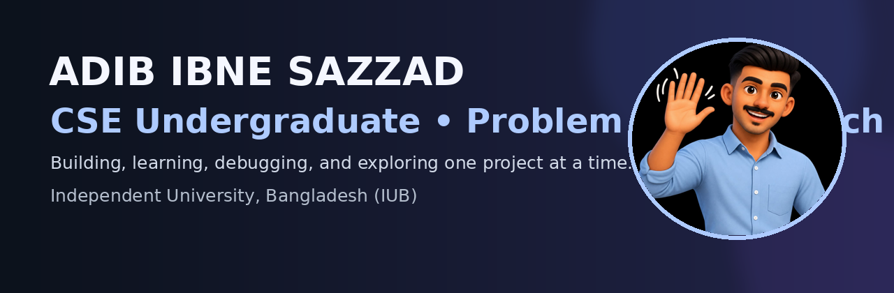

<div align="center">



<br>

<a href="https://github.com/AdibIbneSazzad">
  
</a>
<a href="mailto:adib070121@gmail.com">
  
</a>
<a href="https://www.linkedin.com/in/adib-ibne-sazzad-64620b432/">
  
</a>
<a href="https://www.instagram.com/adib_sazzad">
  
</a>

</div>

---

## 👋 About Me

Hi, I'm **Adib Ibne Sazzad**, a Computer Science & Engineering undergraduate at **Independent University, Bangladesh (IUB)**.

I'm interested in **problem solving, programming, software development, and learning new technologies**. I enjoy turning ideas into code, practicing algorithms, and improving a little every day.

- 🎓 CSE Undergraduate at IUB
- 💻 Currently strengthening my programming fundamentals
- 🧩 Enjoy solving programming and algorithmic problems
- 🌱 Learning by building projects and experimenting
- 🚀 Always curious about how things work under the hood

---

## 🛠️ Tech Stack

<div align="center">


<br><br>


</div>

---

# 📊 GitHub Analytics

<div align="center">


<br><br>

<a href="https://github.com/AdibIbneSazzad">
  
</a>

<a href="https://github.com/AdibIbneSazzad">
  
</a>

</div>

---

## 🔥 Contribution Streak

<div align="center">


</div>

---

## 📈 Contribution Activity

<div align="center">


</div>

---

## 📅 Commit Graph

<div align="center">


</div>

---

## 🐱 My Coding Companion

<div align="center">


<br><br>

<i>Debugging is easier with a tiny coding companion. 🐾</i>

</div>

---

# ⭐ Featured Projects

<div align="center">

<a href="https://github.com/AdibIbneSazzad">
  
</a>

</div>

<br>

### 🚀 More Projects Coming Soon

I'm currently learning, experimenting, and building new projects.

As I create more repositories, I'll feature my best work here.

---

## 🎯 What I'm Working On

<div align="center">

| 💻 Programming | 🧩 Problem Solving |
|:---:|:---:|
| Strengthening fundamentals | Practicing algorithms |
| Building projects | Improving logical thinking |

| 🌱 Learning | 🚀 Exploring |
|:---:|:---:|
| New technologies | Different areas of CSE |
| Learning by doing | Turning ideas into code |

</div>

---

## 🧠 Currently Exploring

```text
Programming
    ↓
Problem Solving
    ↓
Algorithms & Data Structures
    ↓
Software Development
    ↓
New Technologies
